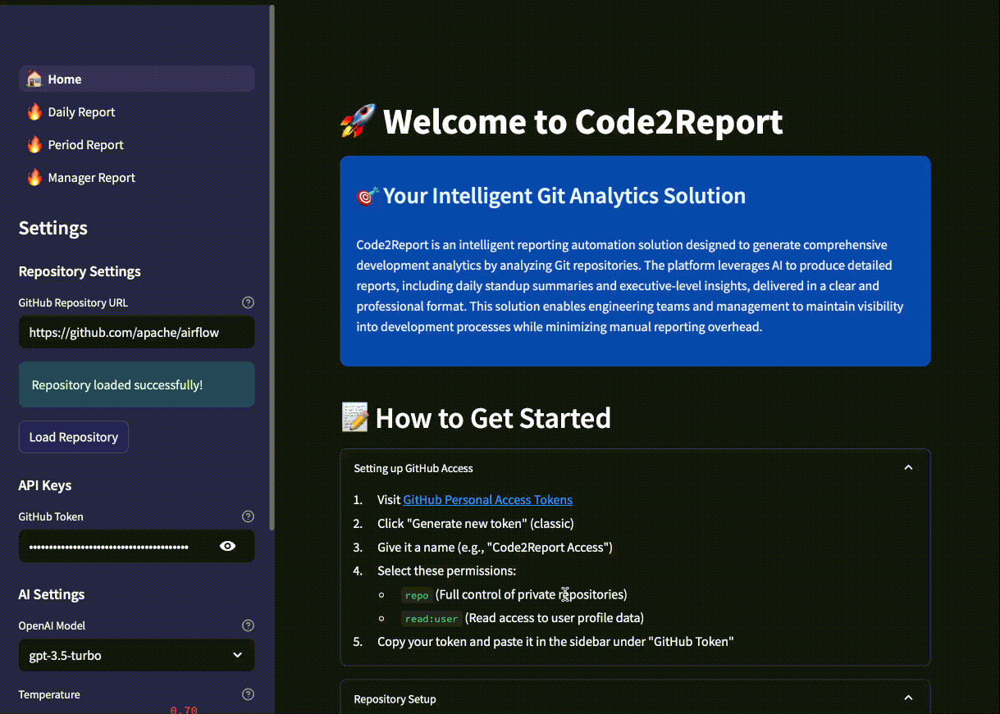

# 🚀 Code2Report — AI-Powered Developer Reporting, Done Right

**Code2Report** is an AI-driven reporting tool that transforms raw developer activity into insightful, structured summaries — with zero effort from the team.

Unlike traditional dashboards that overload you with metrics, Code2Report provides *qualitative insights* — helping tech leads and managers understand what’s happening in their codebase, without digging through commits or holding endless status meetings.

---

## 👨‍💻 MVP Features

We’ve launched our **MVP** with GitHub commit analysis and three ready-to-use report types:

* 📅 **Daily Summary** — perfect for stand-ups
* 📊 **Custom Period Reports** — for sprints or deep reviews
* 📄 **Manager-Friendly Reports** — written in plain English, AI-generated

---

## 🧠 Why It Matters

* ✅ Developers stay focused — no time wasted writing updates
* ✅ Managers get clear, structured summaries in seconds
* ✅ The whole team benefits from transparency and smarter planning

---

## 🎯 Who It's For

* **Tech Leads & Engineering Managers** — who want visibility without micromanaging
* **CTOs** — who need strategic insights without diving into raw code
* **HR & Employer Branding Teams** — who want to offer a developer-friendly environment, free from manual reporting

---

## 🔭 What's Coming Next

Code2Report is evolving into a **cross-platform developer intelligence system**. Future integrations will include:

### 🔌 Planned Integrations

* [ ] **Jira** — sprint & issue tracking
* [ ] **Confluence** — documentation changes
* [ ] **Notion** — team/project workspaces
* [ ] **Trello** — task boards
* [ ] **Linear** — modern product management
* [ ] **GitHub Projects** — planning insights
* [ ] **Slack** — team activity signals
* [ ] **Google Calendar** — meeting load analysis

---

## 📁 Example Reports

Here are some reports we've generated for real open source projects:

* 🔗 [Read more about the project architecture](reports/test.md)
* 🔗 [Weekly Progress: Supabase](https://example.com/report/supabase-weekly)
* 🔗 [Top Contributors: Astro](https://example.com/report/astro-contributors)
* 🔗 [Refactoring Activity: Deno](https://example.com/report/deno-refactor)
  *(Note: links are placeholders — replace with actual reports)*

---

## 🤝 Contact & Access

Want to try Code2Report or request a report for your own repository?

* 💻 **Beta Access**: [code2report](https://zkrov-code2report-28ee.twc1.net)
* 💼 **LinkedIn**: [linkedin.com/company/code2report](https://linkedin.com/company/code2report)
* 💻 **By me a coffee**: [coff.ee/code2report](https://buymeacoffee.com/code2report/extras)

---

